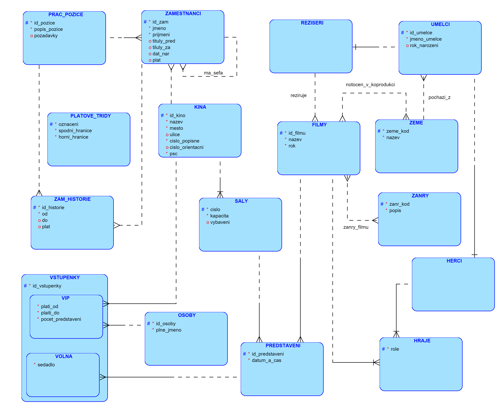

# Kina ktera hrala vsechny ceske a ceskoslovenske filmy, ale jen a pouze tyto (Oracle)

Na schematu z testoveho zadani pridanym o insert script 'prepare_data.sql', ktery obashuje 3 kina kde jedno splnuje nas
dotaz druhe ho splnuje az na podminku ze pouze tyto filmy a treti nema zatim zadny film abychom otestovali edge case.

Samotny dotaz tedy se pta na kina, ktera za prve davali vsechny ceske a ceskoslovenske filmy zaroven vsak musi platit ze
nikdy nehrali zadny zahranicni film.

## Schema - Multikina + prepare_data.sql



## Dotazy

Podivame se na 3 pristupy jak vyresit dany SELECT.

1) [COUNT() = pocet ceskych a ceskoslovenskych filmu](#11-jednoduchy)
2) [CROSS JOIN (Univerzum)](#21-cross-join-jednoduchy)
3) [Dvojita Negace](#31-dvojita-negace-jednoducha)

### 1.1) Jednoduchy

```sql
SELECT kino.nazev
FROM kino
         JOIN formama9.predstaveni ON kino.id_kino = predstaveni.id_kino
         JOIN formama9.film ON film.id_filmu = predstaveni.id_filmu
         JOIN formama9.film_zeme ON film.id_filmu = film_zeme.id_filmu
         JOIN formama9.zeme ON zeme.zeme_kod = film_zeme.zeme_kod
WHERE zeme.nazev = 'Československo'
GROUP BY kino.nazev
HAVING COUNT(zeme.nazev) = (SELECT COUNT(*)
                            FROM zeme
                                     JOIN formama9.film_zeme ON zeme.zeme_kod = film_zeme.zeme_kod
                            WHERE zeme.nazev = 'Československo')
UNION
SELECT kino.nazev
FROM kino
         JOIN formama9.predstaveni ON kino.id_kino = predstaveni.id_kino
         JOIN formama9.film ON film.id_filmu = predstaveni.id_filmu
         JOIN formama9.film_zeme ON film.id_filmu = film_zeme.id_filmu
         JOIN formama9.zeme ON zeme.zeme_kod = film_zeme.zeme_kod
WHERE zeme.nazev = 'Česká republika'
GROUP BY kino.nazev
HAVING COUNT(zeme.nazev) = (SELECT COUNT(*)
                            FROM zeme
                                     JOIN formama9.film_zeme ON zeme.zeme_kod = film_zeme.zeme_kod
                            WHERE zeme.nazev = 'Česká republika')
MINUS
SELECT kino.nazev
FROM kino
         JOIN formama9.predstaveni ON kino.id_kino = predstaveni.id_kino
         JOIN formama9.film ON film.id_filmu = predstaveni.id_filmu
         JOIN formama9.film_zeme ON film.id_filmu = film_zeme.id_filmu
         JOIN formama9.zeme ON zeme.zeme_kod = film_zeme.zeme_kod
WHERE zeme.nazev <> 'Česká republika'
  AND zeme.nazev <> 'Československo';
```

### Plan

```
Plan hash value: 2272350356
 
--------------------------------------------------------------------------------------------------------------
| Id  | Operation                                 | Name             | Rows  | Bytes | Cost (%CPU)| Time     |
--------------------------------------------------------------------------------------------------------------
|   0 | SELECT STATEMENT                          |                  |     2 |  5500 |    30  (20)| 00:00:01 |
|   1 |  MINUS                                    |                  |       |       |            |          |
|   2 |   SORT UNIQUE                             |                  |     2 |  5500 |    30  (20)| 00:00:01 |
|   3 |    UNION-ALL                              |                  |       |       |            |          |
|*  4 |     FILTER                                |                  |       |       |            |          |
|   5 |      HASH GROUP BY                        |                  |     1 |    55 |    10  (20)| 00:00:01 |
|*  6 |       HASH JOIN                           |                  |     9 |   495 |     8   (0)| 00:00:01 |
|   7 |        NESTED LOOPS                       |                  |     9 |   252 |     5   (0)| 00:00:01 |
|   8 |         MERGE JOIN CARTESIAN              |                  |    50 |  1050 |     5   (0)| 00:00:01 |
|   9 |          TABLE ACCESS BY INDEX ROWID      | ZEME             |     1 |    15 |     2   (0)| 00:00:01 |
|* 10 |           INDEX RANGE SCAN                | ZEME_NAZEV_IDX   |     1 |       |     1   (0)| 00:00:01 |
|  11 |          BUFFER SORT                      |                  |    50 |   300 |     3   (0)| 00:00:01 |
|  12 |           TABLE ACCESS FULL               | PREDSTAVENI      |    50 |   300 |     3   (0)| 00:00:01 |
|* 13 |         INDEX UNIQUE SCAN                 | FILM_ZEME__IDX   |     1 |     7 |     0   (0)| 00:00:01 |
|  14 |        TABLE ACCESS FULL                  | KINO             |    15 |   405 |     3   (0)| 00:00:01 |
|  15 |      SORT AGGREGATE                       |                  |     1 |    19 |            |          |
|  16 |       NESTED LOOPS                        |                  |     4 |    76 |     3   (0)| 00:00:01 |
|  17 |        TABLE ACCESS BY INDEX ROWID BATCHED| ZEME             |     1 |    15 |     2   (0)| 00:00:01 |
|* 18 |         INDEX RANGE SCAN                  | ZEME_NAZEV_IDX   |     1 |       |     1   (0)| 00:00:01 |
|* 19 |        INDEX RANGE SCAN                   | FILM_ZEME__IDX   |     4 |    16 |     1   (0)| 00:00:01 |
|* 20 |     FILTER                                |                  |       |       |            |          |
|  21 |      HASH GROUP BY                        |                  |     1 |    55 |    10  (20)| 00:00:01 |
|* 22 |       HASH JOIN                           |                  |     9 |   495 |     8   (0)| 00:00:01 |
|  23 |        NESTED LOOPS                       |                  |     9 |   252 |     5   (0)| 00:00:01 |
|  24 |         MERGE JOIN CARTESIAN              |                  |    50 |  1050 |     5   (0)| 00:00:01 |
|  25 |          TABLE ACCESS BY INDEX ROWID      | ZEME             |     1 |    15 |     2   (0)| 00:00:01 |
|* 26 |           INDEX RANGE SCAN                | ZEME_NAZEV_IDX   |     1 |       |     1   (0)| 00:00:01 |
|  27 |          BUFFER SORT                      |                  |    50 |   300 |     3   (0)| 00:00:01 |
|  28 |           TABLE ACCESS FULL               | PREDSTAVENI      |    50 |   300 |     3   (0)| 00:00:01 |
|* 29 |         INDEX UNIQUE SCAN                 | FILM_ZEME__IDX   |     1 |     7 |     0   (0)| 00:00:01 |
|  30 |        TABLE ACCESS FULL                  | KINO             |    15 |   405 |     3   (0)| 00:00:01 |
|  31 |      SORT AGGREGATE                       |                  |     1 |    19 |            |          |
|  32 |       NESTED LOOPS                        |                  |     4 |    76 |     3   (0)| 00:00:01 |
|  33 |        TABLE ACCESS BY INDEX ROWID BATCHED| ZEME             |     1 |    15 |     2   (0)| 00:00:01 |
|* 34 |         INDEX RANGE SCAN                  | ZEME_NAZEV_IDX   |     1 |       |     1   (0)| 00:00:01 |
|* 35 |        INDEX RANGE SCAN                   | FILM_ZEME__IDX   |     4 |    16 |     1   (0)| 00:00:01 |
|  36 |   SORT UNIQUE                             |                  |    98 |  5390 |    10  (20)| 00:00:01 |
|* 37 |    HASH JOIN SEMI                         |                  |    98 |  5390 |     9  (12)| 00:00:01 |
|* 38 |     HASH JOIN                             |                  |   104 |  4160 |     7  (15)| 00:00:01 |
|  39 |      MERGE JOIN                           |                  |    50 |  1650 |     6  (17)| 00:00:01 |
|  40 |       TABLE ACCESS BY INDEX ROWID         | KINO             |    15 |   405 |     2   (0)| 00:00:01 |
|  41 |        INDEX FULL SCAN                    | Kino PK          |    15 |       |     1   (0)| 00:00:01 |
|* 42 |       SORT JOIN                           |                  |    50 |   300 |     4  (25)| 00:00:01 |
|  43 |        TABLE ACCESS FULL                  | PREDSTAVENI      |    50 |   300 |     3   (0)| 00:00:01 |
|  44 |      INDEX FULL SCAN                      | FILM_ZEME__IDX   |    51 |   357 |     1   (0)| 00:00:01 |
|  45 |     VIEW                                  | index$_join$_032 |    14 |   210 |     2   (0)| 00:00:01 |
|* 46 |      HASH JOIN                            |                  |       |       |            |          |
|* 47 |       INDEX FAST FULL SCAN                | ZEME_NAZEV_IDX   |    14 |   210 |     1   (0)| 00:00:01 |
|  48 |       INDEX FAST FULL SCAN                | zeme PK          |    14 |   210 |     1   (0)| 00:00:01 |
--------------------------------------------------------------------------------------------------------------

```

### Vysledek

```
Nazev kina
---------------------
Westfield Chodov
```

Spravny vysledek, je zpomalovan spoustu mnozinovych operaci (2 Sort Unique).
Obsahuje duplicity a tezko se cte.

### 1.2) With CTE

```sql
WITH cte AS (SELECT kino.nazev AS kin, zeme.nazev AS zem
             FROM kino
                      JOIN formama9.predstaveni ON kino.id_kino = predstaveni.id_kino
                      JOIN formama9.film ON film.id_filmu = predstaveni.id_filmu
                      JOIN formama9.film_zeme ON film.id_filmu = film_zeme.id_filmu
                      JOIN formama9.zeme ON zeme.zeme_kod = film_zeme.zeme_kod),
     cz AS (SELECT kin
            FROM cte
            WHERE zem = 'Česká republika'
            GROUP BY kin
            HAVING COUNT(zem) = (SELECT COUNT(*)
                                 FROM zeme
                                          JOIN formama9.film_zeme ON zeme.zeme_kod = film_zeme.zeme_kod
                                 WHERE zeme.nazev = 'Česká republika')),
     csr AS (SELECT kin
             FROM cte
             WHERE zem = 'Československo'
             GROUP BY kin
             HAVING COUNT(zem) = (SELECT COUNT(*)
                                  FROM zeme
                                           JOIN formama9.film_zeme ON zeme.zeme_kod = film_zeme.zeme_kod
                                  WHERE zeme.nazev = 'Československo')),
     min AS (SELECT kin
             FROM cte
             WHERE zem <> 'Česká republika'
               AND zem <> 'Československo')
SELECT *
FROM cz
UNION
SELECT *
FROM csr
MINUS
SELECT *
FROM min;
```

### Plan

```
Plan hash value: 2182668082
 
--------------------------------------------------------------------------------------------------------------------------
| Id  | Operation                                  | Name                        | Rows  | Bytes | Cost (%CPU)| Time     |
--------------------------------------------------------------------------------------------------------------------------
|   0 | SELECT STATEMENT                           |                             |     2 | 10968 |    11  (46)| 00:00:01 |
|   1 |  TEMP TABLE TRANSFORMATION                 |                             |       |       |            |          |
|   2 |   LOAD AS SELECT                           | SYS_TEMP_0FD9D99CB_486DE25F |       |       |            |          |
|*  3 |    HASH JOIN                               |                             |   104 |  5720 |     9  (12)| 00:00:01 |
|*  4 |     HASH JOIN                              |                             |   104 |  4160 |     7  (15)| 00:00:01 |
|   5 |      MERGE JOIN                            |                             |    50 |  1650 |     6  (17)| 00:00:01 |
|   6 |       TABLE ACCESS BY INDEX ROWID          | KINO                        |    15 |   405 |     2   (0)| 00:00:01 |
|   7 |        INDEX FULL SCAN                     | Kino PK                     |    15 |       |     1   (0)| 00:00:01 |
|*  8 |       SORT JOIN                            |                             |    50 |   300 |     4  (25)| 00:00:01 |
|   9 |        TABLE ACCESS FULL                   | PREDSTAVENI                 |    50 |   300 |     3   (0)| 00:00:01 |
|  10 |      INDEX FULL SCAN                       | FILM_ZEME__IDX              |    51 |   357 |     1   (0)| 00:00:01 |
|  11 |     VIEW                                   | index$_join$_008            |    16 |   240 |     2   (0)| 00:00:01 |
|* 12 |      HASH JOIN                             |                             |       |       |            |          |
|  13 |       INDEX FAST FULL SCAN                 | ZEME_NAZEV_IDX              |    16 |   240 |     1   (0)| 00:00:01 |
|  14 |       INDEX FAST FULL SCAN                 | zeme PK                     |    16 |   240 |     1   (0)| 00:00:01 |
|  15 |   MINUS                                    |                             |       |       |            |          |
|  16 |    SORT UNIQUE                             |                             |     2 | 10968 |    11  (46)| 00:00:01 |
|  17 |     UNION-ALL                              |                             |       |       |            |          |
|* 18 |      FILTER                                |                             |       |       |            |          |
|  19 |       HASH GROUP BY                        |                             |     1 |    76 |     4  (50)| 00:00:01 |
|* 20 |        VIEW                                |                             |   104 |  7904 |     2   (0)| 00:00:01 |
|  21 |         TABLE ACCESS FULL                  | SYS_TEMP_0FD9D99CB_486DE25F |   104 |  3640 |     2   (0)| 00:00:01 |
|  22 |       SORT AGGREGATE                       |                             |     1 |    19 |            |          |
|  23 |        NESTED LOOPS                        |                             |     4 |    76 |     3   (0)| 00:00:01 |
|  24 |         TABLE ACCESS BY INDEX ROWID BATCHED| ZEME                        |     1 |    15 |     2   (0)| 00:00:01 |
|* 25 |          INDEX RANGE SCAN                  | ZEME_NAZEV_IDX              |     1 |       |     1   (0)| 00:00:01 |
|* 26 |         INDEX RANGE SCAN                   | FILM_ZEME__IDX              |     4 |    16 |     1   (0)| 00:00:01 |
|* 27 |      FILTER                                |                             |       |       |            |          |
|  28 |       HASH GROUP BY                        |                             |     1 |    76 |     4  (50)| 00:00:01 |
|* 29 |        VIEW                                |                             |   104 |  7904 |     2   (0)| 00:00:01 |
|  30 |         TABLE ACCESS FULL                  | SYS_TEMP_0FD9D99CB_486DE25F |   104 |  3640 |     2   (0)| 00:00:01 |
|  31 |       SORT AGGREGATE                       |                             |     1 |    19 |            |          |
|  32 |        NESTED LOOPS                        |                             |     4 |    76 |     3   (0)| 00:00:01 |
|  33 |         TABLE ACCESS BY INDEX ROWID BATCHED| ZEME                        |     1 |    15 |     2   (0)| 00:00:01 |
|* 34 |          INDEX RANGE SCAN                  | ZEME_NAZEV_IDX              |     1 |       |     1   (0)| 00:00:01 |
|* 35 |         INDEX RANGE SCAN                   | FILM_ZEME__IDX              |     4 |    16 |     1   (0)| 00:00:01 |
|  36 |    SORT UNIQUE                             |                             |   104 | 10816 |     3  (34)| 00:00:01 |
|* 37 |     VIEW                                   |                             |   104 | 10816 |     2   (0)| 00:00:01 |
|  38 |      TABLE ACCESS FULL                     | SYS_TEMP_0FD9D99CB_486DE25F |   104 |  3640 |     2   (0)| 00:00:01 |
--------------------------------------------------------------------------------------------------------------------------
```

### Vysledek

Zlepsili jsme citelnost, duplicity uz nejsou diky CTE a vyrazne snizeny cost.

### 1.3) Optimized (funguje diky tomu ze muzou mit pouze ceske a ceskoslovenske filmy)

```sql
SELECT kino.nazev
FROM kino
         JOIN formama9.predstaveni ON kino.id_kino = predstaveni.id_kino
         JOIN formama9.film ON film.id_filmu = predstaveni.id_filmu
         JOIN formama9.film_zeme ON film.id_filmu = film_zeme.id_filmu
         JOIN formama9.zeme ON zeme.zeme_kod = film_zeme.zeme_kod
WHERE zeme.nazev = 'Československo'
   OR zeme.nazev = 'Česká republika'
GROUP BY kino.nazev
HAVING COUNT(zeme.nazev) = (SELECT COUNT(*)
                            FROM zeme
                                     JOIN formama9.film_zeme ON zeme.zeme_kod = film_zeme.zeme_kod
                            WHERE zeme.nazev = 'Československo'
                               OR zeme.nazev = 'Česká republika');
```

### Plan

```
Plan hash value: 1685911391
 
----------------------------------------------------------------------------------------------------------
| Id  | Operation                               | Name           | Rows  | Bytes | Cost (%CPU)| Time     |
----------------------------------------------------------------------------------------------------------
|   0 | SELECT STATEMENT                        |                |     1 |    55 |    10  (10)| 00:00:01 |
|*  1 |  FILTER                                 |                |       |       |            |          |
|   2 |   HASH GROUP BY                         |                |     1 |    55 |    10  (10)| 00:00:01 |
|*  3 |    HASH JOIN                            |                |    17 |   935 |     9   (0)| 00:00:01 |
|   4 |     NESTED LOOPS                        |                |    17 |   476 |     6   (0)| 00:00:01 |
|   5 |      MERGE JOIN CARTESIAN               |                |   100 |  2100 |     6   (0)| 00:00:01 |
|   6 |       INLIST ITERATOR                   |                |       |       |            |          |
|   7 |        TABLE ACCESS BY INDEX ROWID      | ZEME           |     2 |    30 |     2   (0)| 00:00:01 |
|*  8 |         INDEX RANGE SCAN                | ZEME_NAZEV_IDX |     2 |       |     1   (0)| 00:00:01 |
|   9 |       BUFFER SORT                       |                |    50 |   300 |     4   (0)| 00:00:01 |
|  10 |        TABLE ACCESS FULL                | PREDSTAVENI    |    50 |   300 |     2   (0)| 00:00:01 |
|* 11 |      INDEX UNIQUE SCAN                  | FILM_ZEME__IDX |     1 |     7 |     0   (0)| 00:00:01 |
|  12 |     TABLE ACCESS FULL                   | KINO           |    15 |   405 |     3   (0)| 00:00:01 |
|  13 |   SORT AGGREGATE                        |                |     1 |    19 |            |          |
|* 14 |    HASH JOIN                            |                |     9 |   171 |     3   (0)| 00:00:01 |
|  15 |     INLIST ITERATOR                     |                |       |       |            |          |
|  16 |      TABLE ACCESS BY INDEX ROWID BATCHED| ZEME           |     2 |    30 |     2   (0)| 00:00:01 |
|* 17 |       INDEX RANGE SCAN                  | ZEME_NAZEV_IDX |     2 |       |     1   (0)| 00:00:01 |
|  18 |     INDEX FULL SCAN                     | FILM_ZEME__IDX |    51 |   204 |     1   (0)| 00:00:01 |
----------------------------------------------------------------------------------------------------------
```

### Vysledek

Jeste zmenseny cost a dobra citelnost. Dobro poznamentat ze uz z query2 zde mame INDEXY, ktere rovnez velmi zrychluji dane dotazy.

### 2.1) CROSS JOIN Jednoduchy

```sql
SELECT DISTINCT kino.nazev -- vsechna kina
FROM kino
         JOIN formama9.predstaveni ON kino.id_kino = predstaveni.id_kino
         JOIN formama9.film ON film.id_filmu = predstaveni.id_filmu
         JOIN formama9.film_zeme ON film.id_filmu = film_zeme.id_filmu
         JOIN formama9.zeme ON zeme.zeme_kod = film_zeme.zeme_kod
WHERE kino.nazev NOT IN (SELECT kin -- vyber kina kterym zbylo moznost jeste hrat nejaky CZ nebo CSR film
                         FROM (SELECT kino.nazev AS kin,
                                      film.nazev,
                                      zeme.nazev AS zem -- vsechny moznosti co kina by mohla hrat
                               FROM kino
                                        CROSS JOIN film
                                        JOIN formama9.film_zeme ON film.id_filmu = film_zeme.id_filmu
                                        JOIN formama9.zeme ON zeme.zeme_kod = film_zeme.zeme_kod
                               MINUS
                               SELECT kino.nazev AS kin,
                                      film.nazev,
                                      zeme.nazev AS zem -- vsechna kina co hraji CZ || CSR filmy
                               FROM kino
                                        JOIN formama9.predstaveni ON kino.id_kino = predstaveni.id_kino
                                        JOIN formama9.film ON film.id_filmu = predstaveni.id_filmu
                                        JOIN formama9.film_zeme ON film.id_filmu = film_zeme.id_filmu
                                        JOIN formama9.zeme ON zeme.zeme_kod = film_zeme.zeme_kod
                               WHERE zeme.nazev = 'Československo'
                                  OR zeme.nazev = 'Česká republika') grp
                         WHERE zem = 'Československo'
                            OR zem = 'Česká republika')
  AND kino.nazev NOT IN (SELECT kino.nazev -- Odecti kina co hraji i neco jineho
                         FROM kino
                                  JOIN formama9.predstaveni ON kino.id_kino = predstaveni.id_kino
                                  JOIN formama9.film ON film.id_filmu = predstaveni.id_filmu
                                  JOIN formama9.film_zeme ON film.id_filmu = film_zeme.id_filmu
                                  JOIN formama9.zeme ON zeme.zeme_kod = film_zeme.zeme_kod
                         WHERE zeme.nazev <> 'Česká republika'
                           AND zeme.nazev <> 'Československo');
```

### Plan

```
Plan hash value: 3407134574
 
----------------------------------------------------------------------------------------------------------
| Id  | Operation                             | Name             | Rows  | Bytes | Cost (%CPU)| Time     |
----------------------------------------------------------------------------------------------------------
|   0 | SELECT STATEMENT                      |                  |     3 |   492 |    39  (13)| 00:00:01 |
|   1 |  HASH UNIQUE                          |                  |     3 |   492 |    39  (13)| 00:00:01 |
|*  2 |   HASH JOIN ANTI                      |                  |     3 |   492 |    38  (11)| 00:00:01 |
|*  3 |    HASH JOIN SEMI                     |                  |     3 |   180 |    16  (13)| 00:00:01 |
|*  4 |     HASH JOIN ANTI                    |                  |     3 |   171 |    15  (14)| 00:00:01 |
|   5 |      MERGE JOIN                       |                  |    50 |  1650 |     6  (17)| 00:00:01 |
|   6 |       TABLE ACCESS BY INDEX ROWID     | KINO             |    15 |   405 |     2   (0)| 00:00:01 |
|   7 |        INDEX FULL SCAN                | Kino PK          |    15 |       |     1   (0)| 00:00:01 |
|*  8 |       SORT JOIN                       |                  |    50 |   300 |     4  (25)| 00:00:01 |
|   9 |        TABLE ACCESS FULL              | PREDSTAVENI      |    50 |   300 |     3   (0)| 00:00:01 |
|  10 |      VIEW                             | VW_NSO_1         |    98 |  2352 |     9  (12)| 00:00:01 |
|* 11 |       HASH JOIN SEMI                  |                  |    98 |  5390 |     9  (12)| 00:00:01 |
|* 12 |        HASH JOIN                      |                  |   104 |  4160 |     7  (15)| 00:00:01 |
|  13 |         MERGE JOIN                    |                  |    50 |  1650 |     6  (17)| 00:00:01 |
|  14 |          TABLE ACCESS BY INDEX ROWID  | KINO             |    15 |   405 |     2   (0)| 00:00:01 |
|  15 |           INDEX FULL SCAN             | Kino PK          |    15 |       |     1   (0)| 00:00:01 |
|* 16 |          SORT JOIN                    |                  |    50 |   300 |     4  (25)| 00:00:01 |
|  17 |           TABLE ACCESS FULL           | PREDSTAVENI      |    50 |   300 |     3   (0)| 00:00:01 |
|  18 |         INDEX FULL SCAN               | FILM_ZEME__IDX   |    51 |   357 |     1   (0)| 00:00:01 |
|  19 |        VIEW                           | index$_join$_034 |    14 |   210 |     2   (0)| 00:00:01 |
|* 20 |         HASH JOIN                     |                  |       |       |            |          |
|* 21 |          INDEX FAST FULL SCAN         | ZEME_NAZEV_IDX   |    14 |   210 |     1   (0)| 00:00:01 |
|  22 |          INDEX FAST FULL SCAN         | zeme PK          |    14 |   210 |     1   (0)| 00:00:01 |
|  23 |     INDEX FULL SCAN                   | FILM_ZEME__IDX   |    51 |   153 |     1   (0)| 00:00:01 |
|  24 |    VIEW                               |                  |   128 | 13312 |    22  (10)| 00:00:01 |
|  25 |     MINUS                             |                  |       |       |            |          |
|  26 |      SORT UNIQUE                      |                  |   128 |  8576 |            |          |
|* 27 |       HASH JOIN                       |                  |   128 |  8576 |     9   (0)| 00:00:01 |
|* 28 |        HASH JOIN                      |                  |   128 |  5888 |     7   (0)| 00:00:01 |
|  29 |         MERGE JOIN CARTESIAN          |                  |    30 |  1170 |     6   (0)| 00:00:01 |
|  30 |          INLIST ITERATOR              |                  |       |       |            |          |
|  31 |           TABLE ACCESS BY INDEX ROWID | ZEME             |     2 |    30 |     2   (0)| 00:00:01 |
|* 32 |            INDEX RANGE SCAN           | ZEME_NAZEV_IDX   |     2 |       |     1   (0)| 00:00:01 |
|  33 |          BUFFER SORT                  |                  |    15 |   360 |     4   (0)| 00:00:01 |
|  34 |           TABLE ACCESS FULL           | KINO             |    15 |   360 |     2   (0)| 00:00:01 |
|  35 |         INDEX FULL SCAN               | FILM_ZEME__IDX   |    51 |   357 |     1   (0)| 00:00:01 |
|  36 |        VIEW                           | index$_join$_012 |    30 |   630 |     2   (0)| 00:00:01 |
|* 37 |         HASH JOIN                     |                  |       |       |            |          |
|  38 |          INDEX FAST FULL SCAN         | FILM_NAZEV_IDX   |    30 |   630 |     1   (0)| 00:00:01 |
|  39 |          INDEX FAST FULL SCAN         | film PK          |    30 |   630 |     1   (0)| 00:00:01 |
|  40 |      SORT UNIQUE                      |                  |    14 |  1064 |            |          |
|* 41 |       HASH JOIN                       |                  |    14 |  1064 |    11   (0)| 00:00:01 |
|  42 |        NESTED LOOPS SEMI              |                  |    14 |   686 |     8   (0)| 00:00:01 |
|* 43 |         HASH JOIN                     |                  |   100 |  4200 |     8   (0)| 00:00:01 |
|  44 |          MERGE JOIN CARTESIAN         |                  |   100 |  2100 |     6   (0)| 00:00:01 |
|  45 |           INLIST ITERATOR             |                  |       |       |            |          |
|  46 |            TABLE ACCESS BY INDEX ROWID| ZEME             |     2 |    30 |     2   (0)| 00:00:01 |
|* 47 |             INDEX RANGE SCAN          | ZEME_NAZEV_IDX   |     2 |       |     1   (0)| 00:00:01 |
|  48 |           BUFFER SORT                 |                  |    50 |   300 |     4   (0)| 00:00:01 |
|  49 |            TABLE ACCESS FULL          | PREDSTAVENI      |    50 |   300 |     2   (0)| 00:00:01 |
|  50 |          VIEW                         | index$_join$_021 |    30 |   630 |     2   (0)| 00:00:01 |
|* 51 |           HASH JOIN                   |                  |       |       |            |          |
|  52 |            INDEX FAST FULL SCAN       | FILM_NAZEV_IDX   |    30 |   630 |     1   (0)| 00:00:01 |
|  53 |            INDEX FAST FULL SCAN       | film PK          |    30 |   630 |     1   (0)| 00:00:01 |
|* 54 |         INDEX UNIQUE SCAN             | FILM_ZEME__IDX   |    51 |   357 |     0   (0)| 00:00:01 |
|  55 |        TABLE ACCESS FULL              | KINO             |    15 |   405 |     3   (0)| 00:00:01 |
----------------------------------------------------------------------------------------------------------
```

### Vysledek

Primerene vysoky cost se spatnou citelnosti kterou zlepsime nize. Rovnez redundantni joiny.

### 2.2) Mnozinove operace

```sql
SELECT kino.nazev -- vsechna kina
FROM kino
         JOIN formama9.predstaveni ON kino.id_kino = predstaveni.id_kino
         JOIN formama9.film ON film.id_filmu = predstaveni.id_filmu
         JOIN formama9.film_zeme ON film.id_filmu = film_zeme.id_filmu
         JOIN formama9.zeme ON zeme.zeme_kod = film_zeme.zeme_kod
MINUS
SELECT kin -- vyber kina kterym zbylo moznost jeste hrat nejaky CZ nebo CSR film
FROM (SELECT kino.nazev AS kin, film.nazev, zeme.nazev AS zem -- vsechny moznosti co kina by mohla hrat
      FROM kino
               CROSS JOIN film
               JOIN formama9.film_zeme ON film.id_filmu = film_zeme.id_filmu
               JOIN formama9.zeme ON zeme.zeme_kod = film_zeme.zeme_kod
      MINUS
      SELECT kino.nazev AS kin, film.nazev, zeme.nazev AS zem -- vsechna kina co hraji CZ || CSR filmy
      FROM kino
               JOIN formama9.predstaveni ON kino.id_kino = predstaveni.id_kino
               JOIN formama9.film ON film.id_filmu = predstaveni.id_filmu
               JOIN formama9.film_zeme ON film.id_filmu = film_zeme.id_filmu
               JOIN formama9.zeme ON zeme.zeme_kod = film_zeme.zeme_kod
      WHERE zeme.nazev = 'Československo'
         OR zeme.nazev = 'Česká republika') grp
WHERE zem = 'Československo'
   OR zem = 'Česká republika'
MINUS
SELECT kino.nazev -- Odecti kina co hraji i neco jineho
FROM kino
         JOIN formama9.predstaveni ON kino.id_kino = predstaveni.id_kino
         JOIN formama9.film ON film.id_filmu = predstaveni.id_filmu
         JOIN formama9.film_zeme ON film.id_filmu = film_zeme.id_filmu
         JOIN formama9.zeme ON zeme.zeme_kod = film_zeme.zeme_kod
WHERE zeme.nazev <> 'Česká republika'
  AND zeme.nazev <> 'Československo';
```

### Plan

```
Plan hash value: 392481966
 
-----------------------------------------------------------------------------------------------------------
| Id  | Operation                              | Name             | Rows  | Bytes | Cost (%CPU)| Time     |
-----------------------------------------------------------------------------------------------------------
|   0 | SELECT STATEMENT                       |                  |    50 | 20502 |    41  (18)| 00:00:01 |
|   1 |  MINUS                                 |                  |       |       |            |          |
|   2 |   MINUS                                |                  |       |       |            |          |
|   3 |    SORT UNIQUE                         |                  |    50 |  1800 |     8  (25)| 00:00:01 |
|*  4 |     HASH JOIN SEMI                     |                  |    50 |  1800 |     7  (15)| 00:00:01 |
|   5 |      MERGE JOIN                        |                  |    50 |  1650 |     6  (17)| 00:00:01 |
|   6 |       TABLE ACCESS BY INDEX ROWID      | KINO             |    15 |   405 |     2   (0)| 00:00:01 |
|   7 |        INDEX FULL SCAN                 | Kino PK          |    15 |       |     1   (0)| 00:00:01 |
|*  8 |       SORT JOIN                        |                  |    50 |   300 |     4  (25)| 00:00:01 |
|   9 |        TABLE ACCESS FULL               | PREDSTAVENI      |    50 |   300 |     3   (0)| 00:00:01 |
|  10 |      INDEX FULL SCAN                   | FILM_ZEME__IDX   |    51 |   153 |     1   (0)| 00:00:01 |
|  11 |    SORT UNIQUE                         |                  |   128 | 13312 |    23  (14)| 00:00:01 |
|  12 |     VIEW                               |                  |   128 | 13312 |    22  (10)| 00:00:01 |
|  13 |      MINUS                             |                  |       |       |            |          |
|  14 |       SORT UNIQUE                      |                  |   128 |  8576 |            |          |
|* 15 |        HASH JOIN                       |                  |   128 |  8576 |     9   (0)| 00:00:01 |
|* 16 |         HASH JOIN                      |                  |   128 |  5888 |     7   (0)| 00:00:01 |
|  17 |          MERGE JOIN CARTESIAN          |                  |    30 |  1170 |     6   (0)| 00:00:01 |
|  18 |           INLIST ITERATOR              |                  |       |       |            |          |
|  19 |            TABLE ACCESS BY INDEX ROWID | ZEME             |     2 |    30 |     2   (0)| 00:00:01 |
|* 20 |             INDEX RANGE SCAN           | ZEME_NAZEV_IDX   |     2 |       |     1   (0)| 00:00:01 |
|  21 |           BUFFER SORT                  |                  |    15 |   360 |     4   (0)| 00:00:01 |
|  22 |            TABLE ACCESS FULL           | KINO             |    15 |   360 |     2   (0)| 00:00:01 |
|  23 |          INDEX FULL SCAN               | FILM_ZEME__IDX   |    51 |   357 |     1   (0)| 00:00:01 |
|  24 |         VIEW                           | index$_join$_012 |    30 |   630 |     2   (0)| 00:00:01 |
|* 25 |          HASH JOIN                     |                  |       |       |            |          |
|  26 |           INDEX FAST FULL SCAN         | FILM_NAZEV_IDX   |    30 |   630 |     1   (0)| 00:00:01 |
|  27 |           INDEX FAST FULL SCAN         | film PK          |    30 |   630 |     1   (0)| 00:00:01 |
|  28 |       SORT UNIQUE                      |                  |    14 |  1064 |            |          |
|* 29 |        HASH JOIN                       |                  |    14 |  1064 |    11   (0)| 00:00:01 |
|  30 |         NESTED LOOPS SEMI              |                  |    14 |   686 |     8   (0)| 00:00:01 |
|* 31 |          HASH JOIN                     |                  |   100 |  4200 |     8   (0)| 00:00:01 |
|  32 |           MERGE JOIN CARTESIAN         |                  |   100 |  2100 |     6   (0)| 00:00:01 |
|  33 |            INLIST ITERATOR             |                  |       |       |            |          |
|  34 |             TABLE ACCESS BY INDEX ROWID| ZEME             |     2 |    30 |     2   (0)| 00:00:01 |
|* 35 |              INDEX RANGE SCAN          | ZEME_NAZEV_IDX   |     2 |       |     1   (0)| 00:00:01 |
|  36 |            BUFFER SORT                 |                  |    50 |   300 |     4   (0)| 00:00:01 |
|  37 |             TABLE ACCESS FULL          | PREDSTAVENI      |    50 |   300 |     2   (0)| 00:00:01 |
|  38 |           VIEW                         | index$_join$_021 |    30 |   630 |     2   (0)| 00:00:01 |
|* 39 |            HASH JOIN                   |                  |       |       |            |          |
|  40 |             INDEX FAST FULL SCAN       | FILM_NAZEV_IDX   |    30 |   630 |     1   (0)| 00:00:01 |
|  41 |             INDEX FAST FULL SCAN       | film PK          |    30 |   630 |     1   (0)| 00:00:01 |
|* 42 |          INDEX UNIQUE SCAN             | FILM_ZEME__IDX   |    51 |   357 |     0   (0)| 00:00:01 |
|  43 |         TABLE ACCESS FULL              | KINO             |    15 |   405 |     3   (0)| 00:00:01 |
|  44 |   SORT UNIQUE                          |                  |    98 |  5390 |    10  (20)| 00:00:01 |
|* 45 |    HASH JOIN SEMI                      |                  |    98 |  5390 |     9  (12)| 00:00:01 |
|* 46 |     HASH JOIN                          |                  |   104 |  4160 |     7  (15)| 00:00:01 |
|  47 |      MERGE JOIN                        |                  |    50 |  1650 |     6  (17)| 00:00:01 |
|  48 |       TABLE ACCESS BY INDEX ROWID      | KINO             |    15 |   405 |     2   (0)| 00:00:01 |
|  49 |        INDEX FULL SCAN                 | Kino PK          |    15 |       |     1   (0)| 00:00:01 |
|* 50 |       SORT JOIN                        |                  |    50 |   300 |     4  (25)| 00:00:01 |
|  51 |        TABLE ACCESS FULL               | PREDSTAVENI      |    50 |   300 |     3   (0)| 00:00:01 |
|  52 |      INDEX FULL SCAN                   | FILM_ZEME__IDX   |    51 |   357 |     1   (0)| 00:00:01 |
|  53 |     VIEW                               | index$_join$_034 |    14 |   210 |     2   (0)| 00:00:01 |
|* 54 |      HASH JOIN                         |                  |       |       |            |          |
|* 55 |       INDEX FAST FULL SCAN             | ZEME_NAZEV_IDX   |    14 |   210 |     1   (0)| 00:00:01 |
|  56 |       INDEX FAST FULL SCAN             | zeme PK          |    14 |   210 |     1   (0)| 00:00:01 |
-----------------------------------------------------------------------------------------------------------
```

### Vysledek

Cost nepatrne se zvetsil avsak konecne je to alepson citelne. Stale redundance.

### 2.3) With CTE

```sql
WITH cte AS (SELECT kino.nazev AS kin, film.nazev AS fim, zeme.nazev AS zem
             FROM kino
                      JOIN formama9.predstaveni ON kino.id_kino = predstaveni.id_kino
                      JOIN formama9.film ON film.id_filmu = predstaveni.id_filmu
                      JOIN formama9.film_zeme ON film.id_filmu = film_zeme.id_filmu
                      JOIN formama9.zeme ON zeme.zeme_kod = film_zeme.zeme_kod)
SELECT kin -- vsechna kina
FROM cte
MINUS
SELECT kin -- vyber kina kterym zbylo moznost jeste hrat nejaky CZ nebo CSR film
FROM (SELECT kino.nazev AS kin, film.nazev, zeme.nazev AS zem -- vsechny moznosti co kina by mohla hrat
      FROM kino
               CROSS JOIN film
               JOIN formama9.film_zeme ON film.id_filmu = film_zeme.id_filmu
               JOIN formama9.zeme ON zeme.zeme_kod = film_zeme.zeme_kod
      MINUS
      SELECT kin, fim, zem -- vsechna kina co hraji CZ || CSR filmy
      FROM cte
      WHERE zem = 'Československo'
         OR zem = 'Česká republika') grp
WHERE zem = 'Československo'
   OR zem = 'Česká republika'
MINUS
SELECT kin -- Odecti kina co hraji i neco jineho
FROM cte
WHERE zem <> 'Česká republika'
  AND zem <> 'Československo';
```

### Plan

```
Plan hash value: 514164193
 
----------------------------------------------------------------------------------------------------------------------
| Id  | Operation                              | Name                        | Rows  | Bytes | Cost (%CPU)| Time     |
----------------------------------------------------------------------------------------------------------------------
|   0 | SELECT STATEMENT                       |                             |    85 | 26572 |    20  (25)| 00:00:01 |
|   1 |  TEMP TABLE TRANSFORMATION             |                             |       |       |            |          |
|   2 |   LOAD AS SELECT                       | SYS_TEMP_0FD9D99CC_486DE25F |       |       |            |          |
|*  3 |    HASH JOIN                           |                             |    85 |  6460 |    11  (10)| 00:00:01 |
|*  4 |     HASH JOIN                          |                             |    85 |  5185 |     9  (12)| 00:00:01 |
|*  5 |      HASH JOIN                         |                             |    50 |  2700 |     8  (13)| 00:00:01 |
|   6 |       MERGE JOIN                       |                             |    50 |  1650 |     6  (17)| 00:00:01 |
|   7 |        TABLE ACCESS BY INDEX ROWID     | KINO                        |    15 |   405 |     2   (0)| 00:00:01 |
|   8 |         INDEX FULL SCAN                | Kino PK                     |    15 |       |     1   (0)| 00:00:01 |
|*  9 |        SORT JOIN                       |                             |    50 |   300 |     4  (25)| 00:00:01 |
|  10 |         TABLE ACCESS FULL              | PREDSTAVENI                 |    50 |   300 |     3   (0)| 00:00:01 |
|  11 |       VIEW                             | index$_join$_004            |    30 |   630 |     2   (0)| 00:00:01 |
|* 12 |        HASH JOIN                       |                             |       |       |            |          |
|  13 |         INDEX FAST FULL SCAN           | FILM_NAZEV_IDX              |    30 |   630 |     1   (0)| 00:00:01 |
|  14 |         INDEX FAST FULL SCAN           | film PK                     |    30 |   630 |     1   (0)| 00:00:01 |
|  15 |      INDEX FULL SCAN                   | FILM_ZEME__IDX              |    51 |   357 |     1   (0)| 00:00:01 |
|  16 |     VIEW                               | index$_join$_008            |    16 |   240 |     2   (0)| 00:00:01 |
|* 17 |      HASH JOIN                         |                             |       |       |            |          |
|  18 |       INDEX FAST FULL SCAN             | ZEME_NAZEV_IDX              |    16 |   240 |     1   (0)| 00:00:01 |
|  19 |       INDEX FAST FULL SCAN             | zeme PK                     |    16 |   240 |     1   (0)| 00:00:01 |
|  20 |   MINUS                                |                             |       |       |            |          |
|  21 |    MINUS                               |                             |       |       |            |          |
|  22 |     SORT UNIQUE                        |                             |    85 |  4420 |     3  (34)| 00:00:01 |
|  23 |      VIEW                              |                             |    85 |  4420 |     2   (0)| 00:00:01 |
|  24 |       TABLE ACCESS FULL                | SYS_TEMP_0FD9D99CC_486DE25F |    85 |  4505 |     2   (0)| 00:00:01 |
|  25 |     SORT UNIQUE                        |                             |   128 | 13312 |    14  (22)| 00:00:01 |
|  26 |      VIEW                              |                             |   128 | 13312 |    13  (16)| 00:00:01 |
|  27 |       MINUS                            |                             |       |       |            |          |
|  28 |        SORT UNIQUE                     |                             |   128 |  8576 |            |          |
|* 29 |         HASH JOIN                      |                             |   128 |  8576 |     9   (0)| 00:00:01 |
|* 30 |          HASH JOIN                     |                             |   128 |  5888 |     7   (0)| 00:00:01 |
|  31 |           MERGE JOIN CARTESIAN         |                             |    30 |  1170 |     6   (0)| 00:00:01 |
|  32 |            INLIST ITERATOR             |                             |       |       |            |          |
|  33 |             TABLE ACCESS BY INDEX ROWID| ZEME                        |     2 |    30 |     2   (0)| 00:00:01 |
|* 34 |              INDEX RANGE SCAN          | ZEME_NAZEV_IDX              |     2 |       |     1   (0)| 00:00:01 |
|  35 |            BUFFER SORT                 |                             |    15 |   360 |     4   (0)| 00:00:01 |
|  36 |             TABLE ACCESS FULL          | KINO                        |    15 |   360 |     2   (0)| 00:00:01 |
|  37 |           INDEX FULL SCAN              | FILM_ZEME__IDX              |    51 |   357 |     1   (0)| 00:00:01 |
|  38 |          VIEW                          | index$_join$_013            |    30 |   630 |     2   (0)| 00:00:01 |
|* 39 |           HASH JOIN                    |                             |       |       |            |          |
|  40 |            INDEX FAST FULL SCAN        | FILM_NAZEV_IDX              |    30 |   630 |     1   (0)| 00:00:01 |
|  41 |            INDEX FAST FULL SCAN        | film PK                     |    30 |   630 |     1   (0)| 00:00:01 |
|  42 |        SORT UNIQUE                     |                             |    85 | 17510 |            |          |
|* 43 |         VIEW                           |                             |    85 | 17510 |     2   (0)| 00:00:01 |
|  44 |          TABLE ACCESS FULL             | SYS_TEMP_0FD9D99CC_486DE25F |    85 |  4505 |     2   (0)| 00:00:01 |
|  45 |    SORT UNIQUE                         |                             |    85 |  8840 |     3  (34)| 00:00:01 |
|* 46 |     VIEW                               |                             |    85 |  8840 |     2   (0)| 00:00:01 |
|  47 |      TABLE ACCESS FULL                 | SYS_TEMP_0FD9D99CC_486DE25F |    85 |  4505 |     2   (0)| 00:00:01 |
----------------------------------------------------------------------------------------------------------------------
```

### Vysledek

Dobry cost i citelnost.


### 3.1) Dvojita negace, jednoducha

najdi kina kde neexistuje CZ ci CSR film ktery by nebyl na jeho programu

```sql
SELECT nazev
FROM kino k
WHERE NOT EXISTS(SELECT 1
                 FROM zeme
                          JOIN formama9.film_zeme ON zeme.zeme_kod = film_zeme.zeme_kod
                          JOIN formama9.film f ON f.id_filmu = film_zeme.id_filmu
                 WHERE zeme.nazev = 'Československo'
                   AND f.nazev NOT IN (SELECT film.nazev
                                       FROM film
                                                JOIN formama9.predstaveni ON film.id_filmu = predstaveni.id_filmu
                                                JOIN formama9.kino ON predstaveni.id_kino = k.id_kino))
INTERSECT
SELECT nazev
FROM kino k
WHERE NOT EXISTS(SELECT 1
                 FROM zeme
                          JOIN formama9.film_zeme ON zeme.zeme_kod = film_zeme.zeme_kod
                          JOIN formama9.film f ON f.id_filmu = film_zeme.id_filmu
                 WHERE zeme.nazev = 'Česká republika'
                   AND f.nazev NOT IN (SELECT film.nazev
                                       FROM film
                                                JOIN formama9.predstaveni ON film.id_filmu = predstaveni.id_filmu
                                                JOIN formama9.kino ON predstaveni.id_kino = k.id_kino))
MINUS
SELECT kino.nazev -- Odecti kina co hraji i neco jineho
FROM kino
         JOIN formama9.predstaveni ON kino.id_kino = predstaveni.id_kino
         JOIN formama9.film ON film.id_filmu = predstaveni.id_filmu
         JOIN formama9.film_zeme ON film.id_filmu = film_zeme.id_filmu
         JOIN formama9.zeme ON zeme.zeme_kod = film_zeme.zeme_kod
WHERE zeme.nazev <> 'Česká republika'
  AND zeme.nazev <> 'Československo';
```

### Plan

```
Plan hash value: 303275244
 
-------------------------------------------------------------------------------------------------------
| Id  | Operation                          | Name             | Rows  | Bytes | Cost (%CPU)| Time     |
-------------------------------------------------------------------------------------------------------
|   0 | SELECT STATEMENT                   |                  |    14 |  6146 |   284   (2)| 00:00:01 |
|   1 |  MINUS                             |                  |       |       |            |          |
|   2 |   INTERSECTION                     |                  |       |       |            |          |
|   3 |    SORT UNIQUE                     |                  |    14 |   378 |   137   (1)| 00:00:01 |
|*  4 |     FILTER                         |                  |       |       |            |          |
|   5 |      TABLE ACCESS FULL             | KINO             |    15 |   405 |     3   (0)| 00:00:01 |
|*  6 |      FILTER                        |                  |       |       |            |          |
|   7 |       NESTED LOOPS SEMI            |                  |     4 |   172 |     5   (0)| 00:00:01 |
|   8 |        MERGE JOIN CARTESIAN        |                  |    30 |  1080 |     5   (0)| 00:00:01 |
|   9 |         TABLE ACCESS BY INDEX ROWID| ZEME             |     1 |    15 |     2   (0)| 00:00:01 |
|* 10 |          INDEX RANGE SCAN          | ZEME_NAZEV_IDX   |     1 |       |     1   (0)| 00:00:01 |
|  11 |         BUFFER SORT                |                  |    30 |   630 |     3   (0)| 00:00:01 |
|  12 |          TABLE ACCESS FULL         | FILM             |    30 |   630 |     3   (0)| 00:00:01 |
|* 13 |        INDEX UNIQUE SCAN           | FILM_ZEME__IDX   |    51 |   357 |     0   (0)| 00:00:01 |
|  14 |       MERGE JOIN CARTESIAN         |                  |    13 |   351 |     6   (0)| 00:00:01 |
|  15 |        NESTED LOOPS SEMI           |                  |     1 |    27 |     5   (0)| 00:00:01 |
|  16 |         TABLE ACCESS BY INDEX ROWID| FILM             |     1 |    21 |     2   (0)| 00:00:01 |
|* 17 |          INDEX RANGE SCAN          | FILM_NAZEV_IDX   |     1 |       |     1   (0)| 00:00:01 |
|* 18 |         TABLE ACCESS FULL          | PREDSTAVENI      |     3 |    18 |     3   (0)| 00:00:01 |
|  19 |        BUFFER SORT                 |                  |    15 |       |     3   (0)| 00:00:01 |
|  20 |         INDEX FULL SCAN            | KINO_MESTO_IDX   |    15 |       |     1   (0)| 00:00:01 |
|  21 |    SORT UNIQUE                     |                  |    14 |   378 |   137   (1)| 00:00:01 |
|* 22 |     FILTER                         |                  |       |       |            |          |
|  23 |      TABLE ACCESS FULL             | KINO             |    15 |   405 |     3   (0)| 00:00:01 |
|* 24 |      FILTER                        |                  |       |       |            |          |
|  25 |       NESTED LOOPS SEMI            |                  |     4 |   172 |     5   (0)| 00:00:01 |
|  26 |        MERGE JOIN CARTESIAN        |                  |    30 |  1080 |     5   (0)| 00:00:01 |
|  27 |         TABLE ACCESS BY INDEX ROWID| ZEME             |     1 |    15 |     2   (0)| 00:00:01 |
|* 28 |          INDEX RANGE SCAN          | ZEME_NAZEV_IDX   |     1 |       |     1   (0)| 00:00:01 |
|  29 |         BUFFER SORT                |                  |    30 |   630 |     3   (0)| 00:00:01 |
|  30 |          TABLE ACCESS FULL         | FILM             |    30 |   630 |     3   (0)| 00:00:01 |
|* 31 |        INDEX UNIQUE SCAN           | FILM_ZEME__IDX   |    51 |   357 |     0   (0)| 00:00:01 |
|  32 |       MERGE JOIN CARTESIAN         |                  |    13 |   351 |     6   (0)| 00:00:01 |
|  33 |        NESTED LOOPS SEMI           |                  |     1 |    27 |     5   (0)| 00:00:01 |
|  34 |         TABLE ACCESS BY INDEX ROWID| FILM             |     1 |    21 |     2   (0)| 00:00:01 |
|* 35 |          INDEX RANGE SCAN          | FILM_NAZEV_IDX   |     1 |       |     1   (0)| 00:00:01 |
|* 36 |         TABLE ACCESS FULL          | PREDSTAVENI      |     3 |    18 |     3   (0)| 00:00:01 |
|  37 |        BUFFER SORT                 |                  |    15 |       |     3   (0)| 00:00:01 |
|  38 |         INDEX FULL SCAN            | KINO_MESTO_IDX   |    15 |       |     1   (0)| 00:00:01 |
|  39 |   SORT UNIQUE                      |                  |    98 |  5390 |    10  (20)| 00:00:01 |
|* 40 |    HASH JOIN SEMI                  |                  |    98 |  5390 |     9  (12)| 00:00:01 |
|* 41 |     HASH JOIN                      |                  |   104 |  4160 |     7  (15)| 00:00:01 |
|  42 |      MERGE JOIN                    |                  |    50 |  1650 |     6  (17)| 00:00:01 |
|  43 |       TABLE ACCESS BY INDEX ROWID  | KINO             |    15 |   405 |     2   (0)| 00:00:01 |
|  44 |        INDEX FULL SCAN             | Kino PK          |    15 |       |     1   (0)| 00:00:01 |
|* 45 |       SORT JOIN                    |                  |    50 |   300 |     4  (25)| 00:00:01 |
|  46 |        TABLE ACCESS FULL           | PREDSTAVENI      |    50 |   300 |     3   (0)| 00:00:01 |
|  47 |      INDEX FULL SCAN               | FILM_ZEME__IDX   |    51 |   357 |     1   (0)| 00:00:01 |
|  48 |     VIEW                           | index$_join$_030 |    14 |   210 |     2   (0)| 00:00:01 |
|* 49 |      HASH JOIN                     |                  |       |       |            |          |
|* 50 |       INDEX FAST FULL SCAN         | ZEME_NAZEV_IDX   |    14 |   210 |     1   (0)| 00:00:01 |
|  51 |       INDEX FAST FULL SCAN         | zeme PK          |    14 |   210 |     1   (0)| 00:00:01 |
-------------------------------------------------------------------------------------------------------
```

### Vysledek

Velky cost, spatne prehledne, velmi redundantni = strasne.

### 3.2) Logika namisto intersectu

```sql
SELECT nazev
FROM kino k
WHERE NOT EXISTS(SELECT 1
                 FROM zeme
                          JOIN formama9.film_zeme ON zeme.zeme_kod = film_zeme.zeme_kod
                          JOIN formama9.film f ON f.id_filmu = film_zeme.id_filmu
                 WHERE (zeme.nazev = 'Československo' OR zeme.nazev = 'Česká republika')
                   AND f.nazev NOT IN (SELECT film.nazev
                                       FROM film
                                                JOIN formama9.predstaveni ON film.id_filmu = predstaveni.id_filmu
                                                JOIN formama9.kino ON predstaveni.id_kino = k.id_kino))
MINUS
SELECT kino.nazev -- Odecti kina co hraji i neco jineho
FROM kino
         JOIN formama9.predstaveni ON kino.id_kino = predstaveni.id_kino
         JOIN formama9.film ON film.id_filmu = predstaveni.id_filmu
         JOIN formama9.film_zeme ON film.id_filmu = film_zeme.id_filmu
         JOIN formama9.zeme ON zeme.zeme_kod = film_zeme.zeme_kod
WHERE zeme.nazev <> 'Česká republika'
  AND zeme.nazev <> 'Československo';
```

### Plan

```
Plan hash value: 3435664270
 
-------------------------------------------------------------------------------------------------------
| Id  | Operation                          | Name             | Rows  | Bytes | Cost (%CPU)| Time     |
-------------------------------------------------------------------------------------------------------
|   0 | SELECT STATEMENT                   |                  |    14 |  5768 |   250   (2)| 00:00:01 |
|   1 |  MINUS                             |                  |       |       |            |          |
|   2 |   SORT UNIQUE                      |                  |    14 |   378 |   240   (1)| 00:00:01 |
|*  3 |    FILTER                          |                  |       |       |            |          |
|   4 |     TABLE ACCESS FULL              | KINO             |    15 |   405 |     3   (0)| 00:00:01 |
|*  5 |     FILTER                         |                  |       |       |            |          |
|   6 |      NESTED LOOPS SEMI             |                  |     8 |   344 |     6   (0)| 00:00:01 |
|   7 |       MERGE JOIN CARTESIAN         |                  |    60 |  2160 |     6   (0)| 00:00:01 |
|   8 |        INLIST ITERATOR             |                  |       |       |            |          |
|   9 |         TABLE ACCESS BY INDEX ROWID| ZEME             |     2 |    30 |     2   (0)| 00:00:01 |
|* 10 |          INDEX RANGE SCAN          | ZEME_NAZEV_IDX   |     2 |       |     1   (0)| 00:00:01 |
|  11 |        BUFFER SORT                 |                  |    30 |   630 |     4   (0)| 00:00:01 |
|  12 |         TABLE ACCESS FULL          | FILM             |    30 |   630 |     2   (0)| 00:00:01 |
|* 13 |       INDEX UNIQUE SCAN            | FILM_ZEME__IDX   |    51 |   357 |     0   (0)| 00:00:01 |
|  14 |      MERGE JOIN CARTESIAN          |                  |    13 |   351 |     6   (0)| 00:00:01 |
|  15 |       NESTED LOOPS SEMI            |                  |     1 |    27 |     5   (0)| 00:00:01 |
|  16 |        TABLE ACCESS BY INDEX ROWID | FILM             |     1 |    21 |     2   (0)| 00:00:01 |
|* 17 |         INDEX RANGE SCAN           | FILM_NAZEV_IDX   |     1 |       |     1   (0)| 00:00:01 |
|* 18 |        TABLE ACCESS FULL           | PREDSTAVENI      |     3 |    18 |     3   (0)| 00:00:01 |
|  19 |       BUFFER SORT                  |                  |    15 |       |     3   (0)| 00:00:01 |
|  20 |        INDEX FULL SCAN             | KINO_MESTO_IDX   |    15 |       |     1   (0)| 00:00:01 |
|  21 |   SORT UNIQUE                      |                  |    98 |  5390 |    10  (20)| 00:00:01 |
|* 22 |    HASH JOIN SEMI                  |                  |    98 |  5390 |     9  (12)| 00:00:01 |
|* 23 |     HASH JOIN                      |                  |   104 |  4160 |     7  (15)| 00:00:01 |
|  24 |      MERGE JOIN                    |                  |    50 |  1650 |     6  (17)| 00:00:01 |
|  25 |       TABLE ACCESS BY INDEX ROWID  | KINO             |    15 |   405 |     2   (0)| 00:00:01 |
|  26 |        INDEX FULL SCAN             | Kino PK          |    15 |       |     1   (0)| 00:00:01 |
|* 27 |       SORT JOIN                    |                  |    50 |   300 |     4  (25)| 00:00:01 |
|  28 |        TABLE ACCESS FULL           | PREDSTAVENI      |    50 |   300 |     3   (0)| 00:00:01 |
|  29 |      INDEX FULL SCAN               | FILM_ZEME__IDX   |    51 |   357 |     1   (0)| 00:00:01 |
|  30 |     VIEW                           | index$_join$_019 |    14 |   210 |     2   (0)| 00:00:01 |
|* 31 |      HASH JOIN                     |                  |       |       |            |          |
|* 32 |       INDEX FAST FULL SCAN         | ZEME_NAZEV_IDX   |    14 |   210 |     1   (0)| 00:00:01 |
|  33 |       INDEX FAST FULL SCAN         | zeme PK          |    14 |   210 |     1   (0)| 00:00:01 |
-------------------------------------------------------------------------------------------------------
```

### Vysledek

Cost se moc nepohl kvuli minus ale citelnost je skvela.

### 3.3) NOT IN misto MINUS

```sql
SELECT k.nazev
FROM kino k
WHERE NOT EXISTS(SELECT 1
                 FROM zeme
                          JOIN formama9.film_zeme ON zeme.zeme_kod = film_zeme.zeme_kod
                          JOIN formama9.film f ON f.id_filmu = film_zeme.id_filmu
                 WHERE (zeme.nazev = 'Československo' OR zeme.nazev = 'Česká republika')
                   AND f.nazev NOT IN (SELECT film.nazev
                                       FROM film
                                                JOIN formama9.predstaveni ON film.id_filmu = predstaveni.id_filmu
                                                JOIN formama9.kino ON predstaveni.id_kino = k.id_kino))
  AND k.nazev NOT IN (SELECT kino.nazev
                      FROM kino
                               JOIN formama9.predstaveni ON kino.id_kino = predstaveni.id_kino
                               JOIN formama9.film ON film.id_filmu = predstaveni.id_filmu
                               JOIN formama9.film_zeme ON film.id_filmu = film_zeme.id_filmu
                               JOIN formama9.zeme ON zeme.zeme_kod = film_zeme.zeme_kod
                      WHERE zeme.nazev <> 'Česká republika'
                        AND zeme.nazev <> 'Československo');
```

### Plan

```
Plan hash value: 838519220
 
--------------------------------------------------------------------------------------------------------------
| Id  | Operation                                 | Name             | Rows  | Bytes | Cost (%CPU)| Time     |
--------------------------------------------------------------------------------------------------------------
|   0 | SELECT STATEMENT                          |                  |     1 |    79 |    52   (2)| 00:00:01 |
|*  1 |  FILTER                                   |                  |       |       |            |          |
|*  2 |   HASH JOIN ANTI                          |                  |     1 |    79 |    12   (9)| 00:00:01 |
|   3 |    TABLE ACCESS FULL                      | KINO             |    15 |   405 |     3   (0)| 00:00:01 |
|   4 |    VIEW                                   | VW_NSO_1         |    98 |  5096 |     9  (12)| 00:00:01 |
|*  5 |     HASH JOIN SEMI                        |                  |    98 |  5390 |     9  (12)| 00:00:01 |
|*  6 |      HASH JOIN                            |                  |   104 |  4160 |     7  (15)| 00:00:01 |
|   7 |       MERGE JOIN                          |                  |    50 |  1650 |     6  (17)| 00:00:01 |
|   8 |        TABLE ACCESS BY INDEX ROWID        | KINO             |    15 |   405 |     2   (0)| 00:00:01 |
|   9 |         INDEX FULL SCAN                   | Kino PK          |    15 |       |     1   (0)| 00:00:01 |
|* 10 |        SORT JOIN                          |                  |    50 |   300 |     4  (25)| 00:00:01 |
|  11 |         TABLE ACCESS FULL                 | PREDSTAVENI      |    50 |   300 |     3   (0)| 00:00:01 |
|  12 |       INDEX FULL SCAN                     | FILM_ZEME__IDX   |    51 |   357 |     1   (0)| 00:00:01 |
|  13 |      VIEW                                 | index$_join$_019 |    14 |   210 |     2   (0)| 00:00:01 |
|* 14 |       HASH JOIN                           |                  |       |       |            |          |
|* 15 |        INDEX FAST FULL SCAN               | ZEME_NAZEV_IDX   |    14 |   210 |     1   (0)| 00:00:01 |
|  16 |        INDEX FAST FULL SCAN               | zeme PK          |    14 |   210 |     1   (0)| 00:00:01 |
|* 17 |   FILTER                                  |                  |       |       |            |          |
|  18 |    NESTED LOOPS                           |                  |    12 |   516 |     4   (0)| 00:00:01 |
|  19 |     NESTED LOOPS                          |                  |    12 |   516 |     4   (0)| 00:00:01 |
|* 20 |      HASH JOIN SEMI                       |                  |     2 |    44 |     3   (0)| 00:00:01 |
|  21 |       INDEX FULL SCAN                     | FILM_ZEME__IDX   |    51 |   357 |     1   (0)| 00:00:01 |
|  22 |       INLIST ITERATOR                     |                  |       |       |            |          |
|  23 |        TABLE ACCESS BY INDEX ROWID BATCHED| ZEME             |     2 |    30 |     2   (0)| 00:00:01 |
|* 24 |         INDEX RANGE SCAN                  | ZEME_NAZEV_IDX   |     2 |       |     1   (0)| 00:00:01 |
|* 25 |      INDEX UNIQUE SCAN                    | film PK          |     1 |       |     0   (0)| 00:00:01 |
|  26 |     TABLE ACCESS BY INDEX ROWID           | FILM             |     5 |   105 |     1   (0)| 00:00:01 |
|  27 |    NESTED LOOPS                           |                  |     2 |    54 |     6   (0)| 00:00:01 |
|  28 |     NESTED LOOPS SEMI                     |                  |     1 |    27 |     5   (0)| 00:00:01 |
|  29 |      TABLE ACCESS BY INDEX ROWID BATCHED  | FILM             |     1 |    21 |     2   (0)| 00:00:01 |
|* 30 |       INDEX RANGE SCAN                    | FILM_NAZEV_IDX   |     1 |       |     1   (0)| 00:00:01 |
|* 31 |      TABLE ACCESS FULL                    | PREDSTAVENI      |     3 |    18 |     3   (0)| 00:00:01 |
|  32 |     INDEX FULL SCAN                       | KINO_MESTO_IDX   |     2 |       |     1   (0)| 00:00:01 |
--------------------------------------------------------------------------------------------------------------
```

### Vysledek

Citelnost jemne klesla ale Cost nyni uz 5x lepsi oproti zacatku.

### 3.4) Prepis NOT IN na LEFT JOIN

```sql
SELECT k.nazev
FROM kino k
         LEFT JOIN (SELECT kino.nazev
                    FROM kino
                             JOIN formama9.predstaveni ON kino.id_kino = predstaveni.id_kino
                             JOIN formama9.film ON film.id_filmu = predstaveni.id_filmu
                             JOIN formama9.film_zeme ON film.id_filmu = film_zeme.id_filmu
                             JOIN formama9.zeme ON zeme.zeme_kod = film_zeme.zeme_kod
                    WHERE zeme.nazev <> 'Česká republika'
                      AND zeme.nazev <> 'Československo') valid_kino ON valid_kino.nazev = k.nazev
WHERE NOT EXISTS(SELECT 1
                 FROM zeme
                          JOIN formama9.film_zeme ON zeme.zeme_kod = film_zeme.zeme_kod
                          JOIN formama9.film f ON f.id_filmu = film_zeme.id_filmu
                          LEFT JOIN (SELECT film.nazev
                                     FROM film
                                              JOIN formama9.predstaveni ON film.id_filmu = predstaveni.id_filmu
                                              JOIN formama9.kino ON predstaveni.id_kino = k.id_kino) not_in_join ON
                     not_in_join.nazev = f.nazev
                 WHERE (zeme.nazev = 'Československo' OR zeme.nazev = 'Česká republika')
                   AND not_in_join.nazev IS NULL)
  AND valid_kino.nazev IS NULL;
```

### Plan

```
Plan hash value: 46292687
 
-------------------------------------------------------------------------------------------------------------
| Id  | Operation                                | Name             | Rows  | Bytes | Cost (%CPU)| Time     |
-------------------------------------------------------------------------------------------------------------
|   0 | SELECT STATEMENT                         |                  |     1 |    79 |    25   (4)| 00:00:01 |
|*  1 |  FILTER                                  |                  |       |       |            |          |
|*  2 |   HASH JOIN ANTI                         |                  |     1 |    79 |    12   (9)| 00:00:01 |
|   3 |    TABLE ACCESS FULL                     | KINO             |    15 |   405 |     3   (0)| 00:00:01 |
|   4 |    VIEW                                  |                  |    98 |  5096 |     9  (12)| 00:00:01 |
|*  5 |     HASH JOIN SEMI                       |                  |    98 |  5390 |     9  (12)| 00:00:01 |
|*  6 |      HASH JOIN                           |                  |   104 |  4160 |     7  (15)| 00:00:01 |
|   7 |       MERGE JOIN                         |                  |    50 |  1650 |     6  (17)| 00:00:01 |
|   8 |        TABLE ACCESS BY INDEX ROWID       | KINO             |    15 |   405 |     2   (0)| 00:00:01 |
|   9 |         INDEX FULL SCAN                  | Kino PK          |    15 |       |     1   (0)| 00:00:01 |
|* 10 |        SORT JOIN                         |                  |    50 |   300 |     4  (25)| 00:00:01 |
|  11 |         TABLE ACCESS FULL                | PREDSTAVENI      |    50 |   300 |     3   (0)| 00:00:01 |
|  12 |       INDEX FULL SCAN                    | FILM_ZEME__IDX   |    51 |   357 |     1   (0)| 00:00:01 |
|  13 |      VIEW                                | index$_join$_010 |    14 |   210 |     2   (0)| 00:00:01 |
|* 14 |       HASH JOIN                          |                  |       |       |            |          |
|* 15 |        INDEX FAST FULL SCAN              | ZEME_NAZEV_IDX   |    14 |   210 |     1   (0)| 00:00:01 |
|  16 |        INDEX FAST FULL SCAN              | zeme PK          |    14 |   210 |     1   (0)| 00:00:01 |
|* 17 |   HASH JOIN ANTI                         |                  |     1 |   145 |    13   (0)| 00:00:01 |
|* 18 |    HASH JOIN                             |                  |     9 |   387 |     5   (0)| 00:00:01 |
|* 19 |     HASH JOIN                            |                  |     9 |   198 |     3   (0)| 00:00:01 |
|  20 |      INLIST ITERATOR                     |                  |       |       |            |          |
|  21 |       TABLE ACCESS BY INDEX ROWID BATCHED| ZEME             |     2 |    30 |     2   (0)| 00:00:01 |
|* 22 |        INDEX RANGE SCAN                  | ZEME_NAZEV_IDX   |     2 |       |     1   (0)| 00:00:01 |
|  23 |      INDEX FULL SCAN                     | FILM_ZEME__IDX   |    51 |   357 |     1   (0)| 00:00:01 |
|  24 |     VIEW                                 | index$_join$_016 |    30 |   630 |     2   (0)| 00:00:01 |
|* 25 |      HASH JOIN                           |                  |       |       |            |          |
|  26 |       INDEX FAST FULL SCAN               | FILM_NAZEV_IDX   |    30 |   630 |     1   (0)| 00:00:01 |
|  27 |       INDEX FAST FULL SCAN               | film PK          |    30 |   630 |     1   (0)| 00:00:01 |
|  28 |    VIEW                                  | VW_DCL_E5E602C4  |    50 |  5100 |     8   (0)| 00:00:01 |
|  29 |     MERGE JOIN CARTESIAN                 |                  |    50 |  1350 |     8   (0)| 00:00:01 |
|* 30 |      HASH JOIN                           |                  |     3 |    81 |     5   (0)| 00:00:01 |
|* 31 |       TABLE ACCESS FULL                  | PREDSTAVENI      |     3 |    18 |     3   (0)| 00:00:01 |
|  32 |       VIEW                               | index$_join$_019 |    30 |   630 |     2   (0)| 00:00:01 |
|* 33 |        HASH JOIN                         |                  |       |       |            |          |
|  34 |         INDEX FAST FULL SCAN             | FILM_NAZEV_IDX   |    30 |   630 |     1   (0)| 00:00:01 |
|  35 |         INDEX FAST FULL SCAN             | film PK          |    30 |   630 |     1   (0)| 00:00:01 |
|  36 |      BUFFER SORT                         |                  |    15 |       |     6   (0)| 00:00:01 |
|  37 |       INDEX FAST FULL SCAN               | KINO_MESTO_IDX   |    15 |       |     1   (0)| 00:00:01 |
-------------------------------------------------------------------------------------------------------------
```

### Vysledek

Cost konecne prijatelny avsak za cenu nulove citelnosti. prvni not in byl to co to zpomalovalo druhy je ekvivalentni tomu jak si to optimalizator preklada.