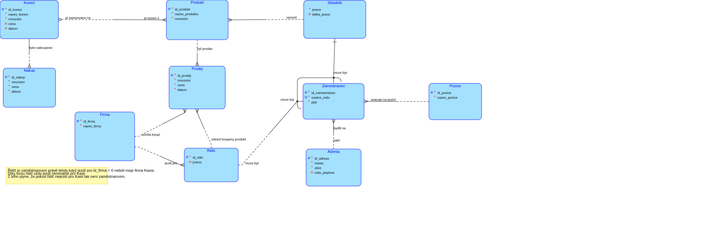

# Nalezni koreni ze ktereho se vytvari nejvice produktu (PostgreSQL)

Budeme se snazit nalezt takove koreni ze ktereho vytvarime co nejvice produktu a jako vysledek dostavame jmeno produktu a pocet produktu ktere se z nej delaji. Kvuli potrebe zkoumat vsechny prvky nam  zde NEpomuze index.

## Schema



## Dotazy

### 1) Jednoduchy dotaz

```sql
SELECT nazev_koreni, COUNT(nazev_koreni) ct
FROM koreni
         JOIN produkt_koreni pk ON koreni.id_koreni = pk.id_koreni
GROUP BY nazev_koreni
HAVING COUNT(nazev_koreni) =
       (SELECT MAX(ct)
        FROM (SELECT nazev_koreni, COUNT(nazev_koreni) ct
              FROM koreni
                       JOIN produkt_koreni pk ON koreni.id_koreni = pk.id_koreni
              GROUP BY nazev_koreni) AS nkc); 
```

### Plan

```
HashAggregate  (cost=7.47..7.84 rows=1 width=21) (actual time=0.161..0.164 rows=1 loops=1)
  Group Key: koreni.nazev_koreni
  Filter: (count(koreni.nazev_koreni) = $0)
  Batches: 1  Memory Usage: 24kB
  Rows Removed by Filter: 20
  InitPlan 1 (returns $0)
    ->  Aggregate  (cost=4.07..4.08 rows=1 width=8) (actual time=0.068..0.070 rows=1 loops=1)
          ->  HashAggregate  (cost=3.39..3.69 rows=30 width=21) (actual time=0.063..0.066 rows=21 loops=1)
                Group Key: koreni_1.nazev_koreni
                Batches: 1  Memory Usage: 24kB
                ->  Hash Join  (cost=1.68..3.19 rows=40 width=13) (actual time=0.044..0.052 rows=40 loops=1)
                      Hash Cond: (pk_1.id_koreni = koreni_1.id_koreni)
                      ->  Seq Scan on produkt_koreni pk_1  (cost=0.00..1.40 rows=40 width=4) (actual time=0.001..0.003 rows=40 loops=1)
                      ->  Hash  (cost=1.30..1.30 rows=30 width=17) (actual time=0.013..0.013 rows=30 loops=1)
                            Buckets: 1024  Batches: 1  Memory Usage: 10kB
                            ->  Seq Scan on koreni koreni_1  (cost=0.00..1.30 rows=30 width=17) (actual time=0.001..0.004 rows=30 loops=1)
  ->  Hash Join  (cost=1.68..3.19 rows=40 width=13) (actual time=0.069..0.077 rows=40 loops=1)
        Hash Cond: (pk.id_koreni = koreni.id_koreni)
        ->  Seq Scan on produkt_koreni pk  (cost=0.00..1.40 rows=40 width=4) (actual time=0.027..0.029 rows=40 loops=1)
        ->  Hash  (cost=1.30..1.30 rows=30 width=17) (actual time=0.022..0.022 rows=30 loops=1)
              Buckets: 1024  Batches: 1  Memory Usage: 10kB
              ->  Seq Scan on koreni  (cost=0.00..1.30 rows=30 width=17) (actual time=0.005..0.008 rows=30 loops=1)
Planning Time: 0.308 ms
Execution Time: 0.293 ms
```

### Vysledek

```
nazev_koreni | ct
Flumazenil   |  4
```

Vraci spravny vysledek, ale je to drahe a pomale.

### 2) With CTE

```sql
WITH mts AS (SELECT nazev_koreni, COUNT(nazev_koreni) ct
             FROM koreni
                      JOIN produkt_koreni pk ON koreni.id_koreni = pk.id_koreni
             GROUP BY nazev_koreni)
SELECT *
FROM mts
WHERE ct = (SELECT MAX(ct) FROM mts);
```

### Plan

```
CTE Scan on mts  (cost=4.38..5.05 rows=1 width=524) (actual time=0.244..0.250 rows=1 loops=1)
  Filter: (ct = $1)
  Rows Removed by Filter: 20
  CTE mts
    ->  HashAggregate  (cost=3.39..3.69 rows=30 width=21) (actual time=0.196..0.206 rows=21 loops=1)
          Group Key: koreni.nazev_koreni
          Batches: 1  Memory Usage: 24kB
          ->  Hash Join  (cost=1.68..3.19 rows=40 width=13) (actual time=0.135..0.161 rows=40 loops=1)
                Hash Cond: (pk.id_koreni = koreni.id_koreni)
                ->  Seq Scan on produkt_koreni pk  (cost=0.00..1.40 rows=40 width=4) (actual time=0.010..0.017 rows=40 loops=1)
                ->  Hash  (cost=1.30..1.30 rows=30 width=17) (actual time=0.087..0.088 rows=30 loops=1)
                      Buckets: 1024  Batches: 1  Memory Usage: 10kB
                      ->  Seq Scan on koreni  (cost=0.00..1.30 rows=30 width=17) (actual time=0.009..0.050 rows=30 loops=1)
  InitPlan 2 (returns $1)
    ->  Aggregate  (cost=0.67..0.68 rows=1 width=8) (actual time=0.039..0.040 rows=1 loops=1)
          ->  CTE Scan on mts mts_1  (cost=0.00..0.60 rows=30 width=8) (actual time=0.000..0.032 rows=21 loops=1)
Planning Time: 0.494 ms
Execution Time: 0.432 ms
```

### Vysledek

```
nazev_koreni | ct
Flumazenil   |  4
```

opet spravny a snizil se nam cost diky predpripravenemu vice krat volanemu CTE.

### 3) 2x Volat VIEW

```sql
CREATE OR REPLACE VIEW multispice AS
SELECT nazev_koreni, COUNT(nazev_koreni) ct
FROM koreni
         JOIN produkt_koreni pk ON koreni.id_koreni = pk.id_koreni
GROUP BY nazev_koreni;


SELECT multispice.nazev_koreni, multispice.ct
FROM multispice
WHERE ct = (SELECT MAX(ct) FROM multispice);
```

### Plan

```
HashAggregate  (cost=3.39..3.77 rows=1 width=21) (actual time=0.132..0.135 rows=1 loops=1)
  Group Key: koreni.nazev_koreni
  Filter: (count(koreni.nazev_koreni) = $0)
  Batches: 1  Memory Usage: 24kB
  Rows Removed by Filter: 20
  InitPlan 1 (returns $0)
    ->  Aggregate  (cost=4.07..4.08 rows=1 width=8) (actual time=0.062..0.062 rows=1 loops=1)
          ->  HashAggregate  (cost=3.39..3.69 rows=30 width=21) (actual time=0.056..0.059 rows=21 loops=1)
                Group Key: koreni_1.nazev_koreni
                Batches: 1  Memory Usage: 24kB
                ->  Hash Join  (cost=1.68..3.19 rows=40 width=13) (actual time=0.037..0.045 rows=40 loops=1)
                      Hash Cond: (pk_1.id_koreni = koreni_1.id_koreni)
                      ->  Seq Scan on produkt_koreni pk_1  (cost=0.00..1.40 rows=40 width=4) (actual time=0.001..0.003 rows=40 loops=1)
                      ->  Hash  (cost=1.30..1.30 rows=30 width=17) (actual time=0.023..0.023 rows=30 loops=1)
                            Buckets: 1024  Batches: 1  Memory Usage: 10kB
                            ->  Seq Scan on koreni koreni_1  (cost=0.00..1.30 rows=30 width=17) (actual time=0.004..0.008 rows=30 loops=1)
  ->  Hash Join  (cost=1.68..3.19 rows=40 width=13) (actual time=0.041..0.051 rows=40 loops=1)
        Hash Cond: (pk.id_koreni = koreni.id_koreni)
        ->  Seq Scan on produkt_koreni pk  (cost=0.00..1.40 rows=40 width=4) (actual time=0.006..0.009 rows=40 loops=1)
        ->  Hash  (cost=1.30..1.30 rows=30 width=17) (actual time=0.022..0.022 rows=30 loops=1)
              Buckets: 1024  Batches: 1  Memory Usage: 10kB
              ->  Seq Scan on koreni  (cost=0.00..1.30 rows=30 width=17) (actual time=0.005..0.008 rows=30 loops=1)
Planning Time: 0.453 ms
Execution Time: 0.261 ms
```

### Vysledek

```
nazev_koreni | ct
Flumazenil   |  4
```

opet dostaneme spravny vysledek za jiz polovicny total cost.

### 4) Materialized view

```sql
CREATE MATERIALIZED VIEW mat_multispice AS
SELECT nazev_koreni, COUNT(nazev_koreni) ct
FROM koreni
         JOIN produkt_koreni pk ON koreni.id_koreni = pk.id_koreni
GROUP BY nazev_koreni
ORDER BY COUNT(nazev_koreni) DESC;

SELECT nazev_koreni, ct
FROM mat_multispice
LIMIT 1;
```

### Plan

```
Limit  (cost=0.00..0.08 rows=1 width=524) (actual time=0.092..0.093 rows=1 loops=1)
  ->  Seq Scan on mat_multispice  (cost=0.00..11.40 rows=140 width=524) (actual time=0.090..0.091 rows=1 loops=1)
Planning Time: 0.336 ms
Execution Time: 0.111 ms
```

### Vysledek

```
nazev_koreni | ct
Flumazenil   |  4
```

Trivialni zpusob zrychleni v tomhle pripade by se spise nevyuzil a zustalo se u zrychleneho obycejneho VIEW.