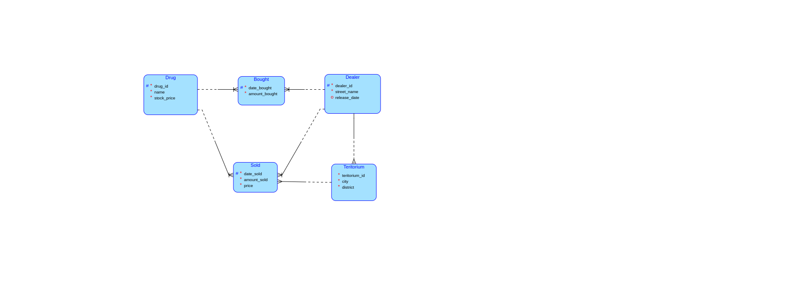

# For each drug find best(max) selling teritory(city, district)  up to date(sum) (PostgreSQL)

We need to get the SUM of all sells in each teritory and than find the MAX selling territory for each drug.

## Diagram



## Queries

### 1) Naive

```sql
SELECT city, district, name, am_sold
FROM (SELECT city, district, name, SUM(amount_sold) AS am_sold
      FROM drug
               JOIN public.sold ON drug.drug_id = sold.drug_id
               JOIN public.teritorium ON teritorium.teritorium_id = sold.teritorium_id
      GROUP BY city, district, name) AS c
WHERE am_sold = (SELECT MAX(am_sold)
                 FROM (SELECT name, SUM(amount_sold) AS am_sold
                       FROM drug
                                JOIN public.sold ON drug.drug_id = sold.drug_id
                                JOIN public.teritorium ON teritorium.teritorium_id = sold.teritorium_id
                       GROUP BY city, district, name) AS cte
                 WHERE c.name = cte.name
                 GROUP BY name)
ORDER BY am_sold DESC;
```

### Plan

```
Sort  (cost=7913.90..7913.90 rows=2 width=67) (actual time=29.902..29.907 rows=10 loops=1)
  Sort Key: c.am_sold DESC
  Sort Method: quicksort  Memory: 25kB
  ->  Subquery Scan on c  (cost=20.34..7913.89 rows=2 width=67) (actual time=2.331..29.876 rows=10 loops=1)
        Filter: (c.am_sold = (SubPlan 1))
        Rows Removed by Filter: 322
        ->  HashAggregate  (cost=20.34..26.28 rows=475 width=67) (actual time=0.934..1.036 rows=332 loops=1)
"              Group Key: teritorium.city, teritorium.district, drug.name"
              Batches: 1  Memory Usage: 105kB
              ->  Hash Join  (cost=3.73..15.59 rows=475 width=43) (actual time=0.434..0.694 rows=475 loops=1)
                    Hash Cond: (sold.teritorium_id = teritorium.teritorium_id)
                    ->  Hash Join  (cost=1.23..11.76 rows=475 width=24) (actual time=0.302..0.472 rows=475 loops=1)
                          Hash Cond: (sold.drug_id = drug.drug_id)
                          ->  Seq Scan on sold  (cost=0.00..8.75 rows=475 width=16) (actual time=0.276..0.337 rows=475 loops=1)
                          ->  Hash  (cost=1.10..1.10 rows=10 width=16) (actual time=0.013..0.014 rows=10 loops=1)
                                Buckets: 1024  Batches: 1  Memory Usage: 9kB
                                ->  Seq Scan on drug  (cost=0.00..1.10 rows=10 width=16) (actual time=0.004..0.006 rows=10 loops=1)
                    ->  Hash  (cost=1.67..1.67 rows=67 width=27) (actual time=0.118..0.119 rows=67 loops=1)
                          Buckets: 1024  Batches: 1  Memory Usage: 12kB
                          ->  Seq Scan on teritorium  (cost=0.00..1.67 rows=67 width=27) (actual time=0.094..0.102 rows=67 loops=1)
        SubPlan 1
          ->  GroupAggregate  (cost=14.79..16.59 rows=48 width=44) (actual time=0.086..0.086 rows=1 loops=332)
                Group Key: drug_1.name
                ->  HashAggregate  (cost=14.79..15.39 rows=48 width=67) (actual time=0.078..0.083 rows=34 loops=332)
"                      Group Key: teritorium_1.city, teritorium_1.district, drug_1.name"
                      Batches: 1  Memory Usage: 24kB
                      ->  Hash Join  (cost=3.65..14.31 rows=48 width=43) (actual time=0.005..0.063 rows=48 loops=332)
                            Hash Cond: (sold_1.teritorium_id = teritorium_1.teritorium_id)
                            ->  Hash Join  (cost=1.14..11.67 rows=48 width=24) (actual time=0.004..0.057 rows=48 loops=332)
                                  Hash Cond: (sold_1.drug_id = drug_1.drug_id)
                                  ->  Seq Scan on sold sold_1  (cost=0.00..8.75 rows=475 width=16) (actual time=0.001..0.023 rows=475 loops=332)
                                  ->  Hash  (cost=1.12..1.12 rows=1 width=16) (actual time=0.001..0.001 rows=1 loops=332)
                                        Buckets: 1024  Batches: 1  Memory Usage: 9kB
                                        ->  Seq Scan on drug drug_1  (cost=0.00..1.12 rows=1 width=16) (actual time=0.001..0.001 rows=1 loops=332)
                                              Filter: ((c.name)::text = (name)::text)
                                              Rows Removed by Filter: 9
                            ->  Hash  (cost=1.67..1.67 rows=67 width=27) (actual time=0.025..0.025 rows=67 loops=1)
                                  Buckets: 1024  Batches: 1  Memory Usage: 12kB
                                  ->  Seq Scan on teritorium teritorium_1  (cost=0.00..1.67 rows=67 width=27) (actual time=0.002..0.010 rows=67 loops=1)
Planning Time: 24.277 ms
Execution Time: 30.111 ms
```

### Result

| city             | district            | name                 | amount sold |
|------------------|---------------------|----------------------|-------------|
| Tijuana          | Playas de Tijuana   | Cocaine              | 774         |
| Guadalajara      | Americana           | Ketamine             | 743         |
| Culiacán         | Infonavit Barrancos | Heroin               | 679         |
| Cancún           | Playa Tortugas      | Marijuana            | 661         |
| Culiacán         | Las Quintas         | Psilocybin Mushrooms | 648         |
| Guadalajara      | Zona Centro         | Crack Cocaine        | 635         |
| Tijuana          | San Antonio del Mar | MDMA (Ecstasy)       | 528         |
| Cabo San Lucas   | El Médano           | Methamphetamine      | 510         |
| Tepito           | Buenavista          | LSD                  | 443         |
| Oaxaca de Juárez | Volcanes            | PCP (Angel Dust)     | 442         |

We are calling 2 times the same query -> we can use WITH (CTE) to make it faster.

### 2) CTE

```sql
WITH cte AS (SELECT city, district, name, SUM(amount_sold) AS am_sold
             FROM drug
                      JOIN public.sold ON drug.drug_id = sold.drug_id
                      JOIN public.teritorium ON teritorium.teritorium_id = sold.teritorium_id
             GROUP BY city, district, name)
SELECT city, district, name, am_sold
FROM cte c
WHERE am_sold = (SELECT MAX(am_sold)
                 FROM cte
                 WHERE c.name = cte.name
                 GROUP BY name)
ORDER BY am_sold DESC;
```

### Plan

```
Sort  (cost=5127.79..5127.79 rows=2 width=1580) (actual time=8.868..8.874 rows=10 loops=1)
  Sort Key: c.am_sold DESC
  Sort Method: quicksort  Memory: 25kB
  CTE cte
    ->  HashAggregate  (cost=20.34..26.28 rows=475 width=67) (actual time=0.371..0.427 rows=332 loops=1)
"          Group Key: teritorium.city, teritorium.district, drug.name"
          Batches: 1  Memory Usage: 105kB
          ->  Hash Join  (cost=3.73..15.59 rows=475 width=43) (actual time=0.082..0.227 rows=475 loops=1)
                Hash Cond: (sold.teritorium_id = teritorium.teritorium_id)
                ->  Hash Join  (cost=1.23..11.76 rows=475 width=24) (actual time=0.027..0.118 rows=475 loops=1)
                      Hash Cond: (sold.drug_id = drug.drug_id)
                      ->  Seq Scan on sold  (cost=0.00..8.75 rows=475 width=16) (actual time=0.007..0.032 rows=475 loops=1)
                      ->  Hash  (cost=1.10..1.10 rows=10 width=16) (actual time=0.015..0.016 rows=10 loops=1)
                            Buckets: 1024  Batches: 1  Memory Usage: 9kB
                            ->  Seq Scan on drug  (cost=0.00..1.10 rows=10 width=16) (actual time=0.009..0.011 rows=10 loops=1)
                ->  Hash  (cost=1.67..1.67 rows=67 width=27) (actual time=0.025..0.026 rows=67 loops=1)
                      Buckets: 1024  Batches: 1  Memory Usage: 12kB
                      ->  Seq Scan on teritorium  (cost=0.00..1.67 rows=67 width=27) (actual time=0.005..0.014 rows=67 loops=1)
  ->  CTE Scan on cte c  (cost=0.00..5101.50 rows=2 width=1580) (actual time=0.714..8.848 rows=10 loops=1)
        Filter: (am_sold = (SubPlan 2))
        Rows Removed by Filter: 322
        SubPlan 2
          ->  GroupAggregate  (cost=0.00..10.72 rows=2 width=548) (actual time=0.025..0.025 rows=1 loops=332)
                Group Key: cte.name
                ->  CTE Scan on cte  (cost=0.00..10.69 rows=2 width=548) (actual time=0.001..0.021 rows=34 loops=332)
                      Filter: ((c.name)::text = (name)::text)
                      Rows Removed by Filter: 298
Planning Time: 0.297 ms
Execution Time: 8.943 ms
```

### Result

Way better planning and cost but still checking the max in WHERE is very slow -> HAVING

### 3) HAVING

```sql
WITH cte AS (SELECT city, district, name, SUM(amount_sold) AS am_sold
             FROM drug
                      JOIN public.sold ON drug.drug_id = sold.drug_id
                      JOIN public.teritorium ON teritorium.teritorium_id = sold.teritorium_id
             GROUP BY city, district, name)
SELECT city, district, name, am_sold
FROM cte c
GROUP BY city, district, name, am_sold
HAVING MAX(c.am_sold) = (SELECT MAX(am_sold)
                         FROM cte
                         WHERE name = c.name
                         GROUP BY name)
ORDER BY am_sold DESC;
```

### Plan

```
Sort  (cost=2187.72..2187.73 rows=1 width=1580) (actual time=8.554..8.559 rows=10 loops=1)
  Sort Key: c.am_sold DESC
  Sort Method: quicksort  Memory: 25kB
  CTE cte
    ->  HashAggregate  (cost=20.34..26.28 rows=475 width=67) (actual time=0.313..0.395 rows=332 loops=1)
"          Group Key: teritorium.city, teritorium.district, drug.name"
          Batches: 1  Memory Usage: 105kB
          ->  Hash Join  (cost=3.73..15.59 rows=475 width=43) (actual time=0.036..0.177 rows=475 loops=1)
                Hash Cond: (sold.teritorium_id = teritorium.teritorium_id)
                ->  Hash Join  (cost=1.23..11.76 rows=475 width=24) (actual time=0.019..0.107 rows=475 loops=1)
                      Hash Cond: (sold.drug_id = drug.drug_id)
                      ->  Seq Scan on sold  (cost=0.00..8.75 rows=475 width=16) (actual time=0.005..0.029 rows=475 loops=1)
                      ->  Hash  (cost=1.10..1.10 rows=10 width=16) (actual time=0.008..0.009 rows=10 loops=1)
                            Buckets: 1024  Batches: 1  Memory Usage: 9kB
                            ->  Seq Scan on drug  (cost=0.00..1.10 rows=10 width=16) (actual time=0.003..0.004 rows=10 loops=1)
                ->  Hash  (cost=1.67..1.67 rows=67 width=27) (actual time=0.014..0.015 rows=67 loops=1)
                      Buckets: 1024  Batches: 1  Memory Usage: 12kB
                      ->  Seq Scan on teritorium  (cost=0.00..1.67 rows=67 width=27) (actual time=0.003..0.007 rows=67 loops=1)
  ->  HashAggregate  (cost=15.44..2161.44 rows=1 width=1580) (actual time=1.797..8.543 rows=10 loops=1)
"        Group Key: c.am_sold, c.city, c.district, c.name"
        Filter: (max(c.am_sold) = (SubPlan 2))
        Batches: 1  Memory Usage: 109kB
        Rows Removed by Filter: 322
        ->  CTE Scan on cte c  (cost=0.00..9.50 rows=475 width=1580) (actual time=0.314..0.507 rows=332 loops=1)
        SubPlan 2
          ->  GroupAggregate  (cost=0.00..10.72 rows=2 width=548) (actual time=0.023..0.023 rows=1 loops=332)
                Group Key: cte.name
                ->  CTE Scan on cte  (cost=0.00..10.69 rows=2 width=548) (actual time=0.001..0.020 rows=34 loops=332)
                      Filter: ((name)::text = (c.name)::text)
                      Rows Removed by Filter: 298
Planning Time: 0.242 ms
Execution Time: 8.625 ms
```

### Result

Half the cost but not really moving the time. We can use JOIN (very powerful) to match it and finally get pretty
optimized query.

### 4) OPTIMIZED

```sql
WITH cte AS (SELECT city, district, name, SUM(amount_sold) AS am_sold
             FROM drug
                      JOIN public.sold ON drug.drug_id = sold.drug_id
                      JOIN public.teritorium ON teritorium.teritorium_id = sold.teritorium_id
             GROUP BY city, district, name)
SELECT city, district, c.name, am_sold
FROM cte c
         JOIN (SELECT name, MAX(am_sold) AS am
               FROM cte
               GROUP BY name) AS ag ON ag.am = c.am_sold AND ag.name = c.name
ORDER BY am_sold DESC;
```

### Plan

```
Sort  (cost=57.15..57.16 rows=2 width=1580) (actual time=0.629..0.631 rows=10 loops=1)
  Sort Key: c.am_sold DESC
  Sort Method: quicksort  Memory: 25kB
  CTE cte
    ->  HashAggregate  (cost=20.34..26.28 rows=475 width=67) (actual time=0.320..0.377 rows=332 loops=1)
"          Group Key: teritorium.city, teritorium.district, drug.name"
          Batches: 1  Memory Usage: 105kB
          ->  Hash Join  (cost=3.73..15.59 rows=475 width=43) (actual time=0.037..0.181 rows=475 loops=1)
                Hash Cond: (sold.teritorium_id = teritorium.teritorium_id)
                ->  Hash Join  (cost=1.23..11.76 rows=475 width=24) (actual time=0.019..0.109 rows=475 loops=1)
                      Hash Cond: (sold.drug_id = drug.drug_id)
                      ->  Seq Scan on sold  (cost=0.00..8.75 rows=475 width=16) (actual time=0.005..0.030 rows=475 loops=1)
                      ->  Hash  (cost=1.10..1.10 rows=10 width=16) (actual time=0.009..0.009 rows=10 loops=1)
                            Buckets: 1024  Batches: 1  Memory Usage: 9kB
                            ->  Seq Scan on drug  (cost=0.00..1.10 rows=10 width=16) (actual time=0.003..0.004 rows=10 loops=1)
                ->  Hash  (cost=1.67..1.67 rows=67 width=27) (actual time=0.014..0.014 rows=67 loops=1)
                      Buckets: 1024  Batches: 1  Memory Usage: 12kB
                      ->  Seq Scan on teritorium  (cost=0.00..1.67 rows=67 width=27) (actual time=0.002..0.006 rows=67 loops=1)
  ->  Hash Join  (cost=18.88..30.87 rows=2 width=1580) (actual time=0.554..0.621 rows=10 loops=1)
        Hash Cond: ((c.am_sold = ag.am) AND ((c.name)::text = (ag.name)::text))
        ->  CTE Scan on cte c  (cost=0.00..9.50 rows=475 width=1580) (actual time=0.322..0.340 rows=332 loops=1)
        ->  Hash  (cost=15.88..15.88 rows=200 width=548) (actual time=0.227..0.227 rows=10 loops=1)
              Buckets: 1024  Batches: 1  Memory Usage: 9kB
              ->  Subquery Scan on ag  (cost=11.88..15.88 rows=200 width=548) (actual time=0.222..0.225 rows=10 loops=1)
                    ->  HashAggregate  (cost=11.88..13.88 rows=200 width=548) (actual time=0.222..0.224 rows=10 loops=1)
                          Group Key: cte.name
                          Batches: 1  Memory Usage: 40kB
                          ->  CTE Scan on cte  (cost=0.00..9.50 rows=475 width=548) (actual time=0.000..0.153 rows=332 loops=1)
Planning Time: 0.308 ms
Execution Time: 0.696 ms
```

### Result

Finally acceptable time thanks to the effective JOIN and CTE, very easy to read.

Plus allows easily adding another complicated options. For example SUM of all MAXES and etc... Try adding it to the
previous, besides it being complicated it's also very costly.

```sql
WITH cte AS (SELECT city, district, name, SUM(amount_sold) AS am_sold
             FROM drug
                      JOIN public.sold ON drug.drug_id = sold.drug_id
                      JOIN public.teritorium ON teritorium.teritorium_id = sold.teritorium_id
             GROUP BY city, district, name)
SELECT city, district, c.name, COALESCE(c.am_sold, SUM(am_sold) OVER ())
FROM cte c
         RIGHT JOIN (SELECT name, MAX(am_sold) AS am
                     FROM cte
                     GROUP BY ROLLUP (name)) -- Could be written as UNION SELECT NULL, NULL
    AS ag ON ag.am = c.am_sold AND ag.name = c.name
ORDER BY am_sold DESC;
```